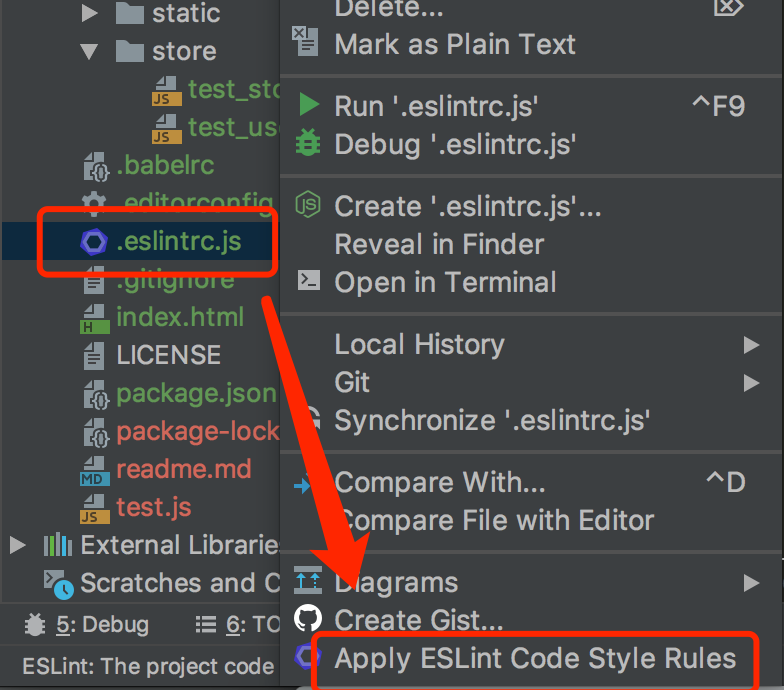

# Vue.js2脚手架（适用于多页项目）

作者：王冬

联系方式：

* qq：20004604
* 微信：qq20004604

## 1、What's in this

Vue2.x脚手架，包含：

* axios（成熟的异步请求封装库，本项目已进行二次封装，方便使用）
* autoprefixer（增加css兼容性前缀）
* babel（实现浏览器兼容）
* eslint（要求代码符合格式才能正常运行，webstorm可以自动格式化）
* less（css预编译器）
* postcss
* webpack3（成熟的打包库）
* uglifyjs-webpack-plugin（代码压缩混淆）
* hotload（热重载，修改代码后不需要刷新）
* 开发模式下ajax转发（本地开发时解决跨域问题）
* 多页模式（按规则建立入口文件，不同入口自动打包为不同html文件）；
* 资源文件夹已分类（并在该文件夹下有相应说明文件）；
* 一个示例demo（见page/test_page）；
* reset.css（重置css样式，使得不同浏览器的样式保持一致）；
* 小图片自动打包到一个static文件夹内；

What's in Vue?

* vue2.6
* vue-router
* vuex

## 2、How to install?

安装和fix一些npm包

> npm install
> 
> npm audit fix

开发模式

> npm run dev

生产模式：

> npm run build

打包后从dist文件夹取出数据

## 3、How to use Eslint-config in IDE?

webstorm应用eslint规则（格式化时自动将代码格式化为符合规则的格式）：

## 4、How to use cli？

### 4.1、入口文件

> 入口文件定义

指webpack的entry属性指向的js文件。

由于 Vue.js 的组件是 ``.vue`` 结尾的，再加上需要前置引入一些依赖，所以 ``.vue`` 文件不能作为入口。

<b>强调：【每次新建一个页面，需要通过新建一个入口文件来实现，并且只需要这样就够了】</b>

> 新建入口文件的方法

目录 ``src/page`` 下，新建一个文件夹，并在文件夹内新建一个 ``app.js`` 文件。该 ``app.js`` 文件即是入口文件。

简单方法：

拷贝脚手架中提供的示例：``src/page/test_demo``，然后改一下文件夹的名字即可。

> 入口文件和常规多个html页面的关系

本脚手架，每次新建一个入口文件便会创建一个html（由脚手架自动处理），因此无需自己新创建html。

当需要更改html引入的js文件时，请更改工程根目录下的 ``index.html`` 文件。js和css文件请按顺序放在html的``<head>``标签内。

假如你需要不同的js入口文件，指向不同的html（即预期打包后的不同html文件，引入的资源不一样），请联系我（联系方式见上）。

> 示例

给了两个示例，分别是：

* 带vue-router、vuex的示例：
其入口文件为 ``src/page/test_page/app.js``
* 纯Vue的示例，其入口文件为 ``src/page/test_demo/app.js``

在示例demo中，已经引入了：vue、vue根组件、公共less配置、封装好的axios异步请求等，如果你需要引入什么依赖，或者vue插件，都可以在app.js里引入。

在第一个示例中，还额外引入了vue-router与vuex。

### 4.2、目录说明

